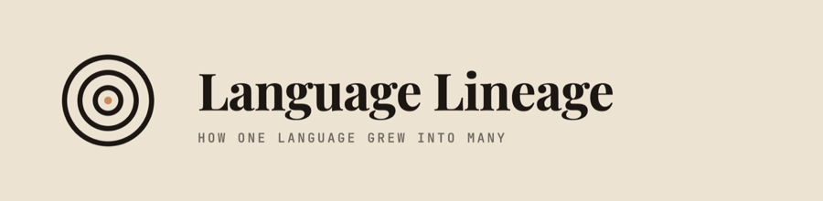
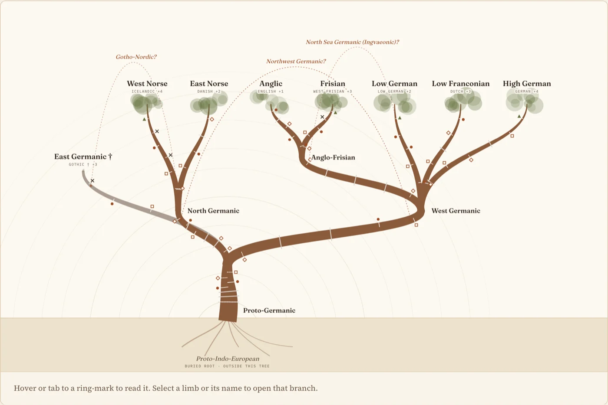
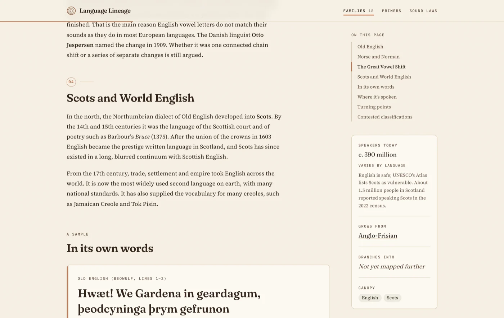
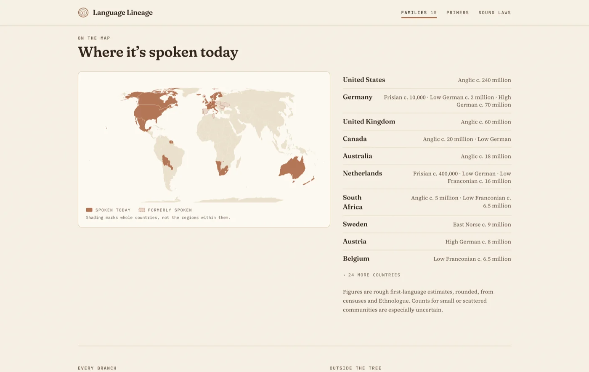
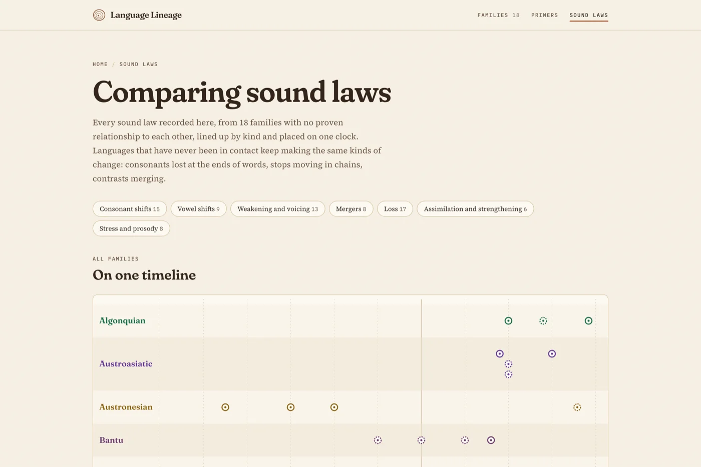

<div align="center">

<picture>
  <source media="(prefers-color-scheme: dark)" srcset=".github/readme/lockup-dark.png">
  
</picture>

**How one branch split from another, the dated sound changes and contact events that drove it,<br>and the classifications historical linguists still dispute.**

[**Read it →**](https://andifathulms.github.io/language-lineage/) &nbsp;·&nbsp;
[Scope](PRD.md) &nbsp;·&nbsp;
[Design](DESIGN.md) &nbsp;·&nbsp;
[Build notes](CLAUDE.md)

[](https://github.com/andifathulms/language-lineage/actions/workflows/deploy.yml)




</div>

## What this is

A read-only narrative encyclopedia of language families. Every family is drawn as one tree: the trunk is the reconstructed proto-language, each limb is a branch, each ring-mark along a limb is a dated turning point — a split, a sound law, a contact event, a writing system adopted, an extinction, a revitalisation. Dotted arcs overhead are the groupings scholars have proposed and not settled.

It is deliberately not a database front-end. Where sources disagree on a date or a grouping, the disagreement is stated on the page rather than resolved away, and a correction is a one-file pull request.

## Coverage

| Family | Within | Branches | Turning points | Disputed |
| --- | --- | ---: | ---: | ---: |
| [Germanic](https://andifathulms.github.io/language-lineage/germanic/) | Indo-European | 12 | 65 | 8 |
| [Semitic](https://andifathulms.github.io/language-lineage/semitic/) | Afroasiatic | 11 | 45 | 5 |
| [Austroasiatic](https://andifathulms.github.io/language-lineage/austroasiatic/) | — | 11 | 36 | 5 |
| [Uto-Aztecan](https://andifathulms.github.io/language-lineage/uto-aztecan/) | — | 11 | 36 | 3 |
| [Algonquian](https://andifathulms.github.io/language-lineage/algonquian/) | Algic | 11 | 36 | 2 |
| [Austronesian](https://andifathulms.github.io/language-lineage/austronesian/) | — | 10 | 49 | 12 |
| [Uralic](https://andifathulms.github.io/language-lineage/uralic/) | — | 10 | 48 | 7 |
| [Pama-Nyungan](https://andifathulms.github.io/language-lineage/pama-nyungan/) | — | 10 | 35 | 3 |
| [Sino-Tibetan](https://andifathulms.github.io/language-lineage/sino-tibetan/) | — | 10 | 34 | 5 |
| [Turkic](https://andifathulms.github.io/language-lineage/turkic/) | — | 9 | 39 | 5 |
| [Bantu](https://andifathulms.github.io/language-lineage/bantu/) | Niger-Congo | 9 | 36 | 6 |
| [Mayan](https://andifathulms.github.io/language-lineage/mayan/) | — | 9 | 27 | 2 |
| [Dravidian](https://andifathulms.github.io/language-lineage/dravidian/) | — | 9 | 25 | 2 |
| [Kra-Dai](https://andifathulms.github.io/language-lineage/kra-dai/) | — | 9 | 23 | 4 |
| [Na-Dene](https://andifathulms.github.io/language-lineage/na-dene/) | — | 8 | 17 | 2 |
| [Japonic](https://andifathulms.github.io/language-lineage/japonic/) | — | 7 | 22 | 3 |
| [Quechuan](https://andifathulms.github.io/language-lineage/quechuan/) | — | 6 | 16 | 2 |
| [Koreanic](https://andifathulms.github.io/language-lineage/koreanic/) | — | 3 | 13 | 1 |

<details>
<summary><b>Which branches each tree draws, and what it refuses to draw</b></summary>

<br>

- **Germanic** — Proto-Germanic → East Germanic †, North Germanic (→ West Norse, East Norse), West Germanic (→ Anglo-Frisian (→ Anglic, Frisian), Low German, Low Franconian, High German). v1 proved the format on a five-node thread here, and it was then widened.
- **Austronesian** — Proto-Austronesian → Formosan languages, Malayo-Polynesian (→ Philippine, Chamic, Malayic, Barito, Central Malayo-Polynesian, Oceanic (→ Polynesian)). Philippine and Central Malayo-Polynesian are drawn as limbs, though their status as subgroups is debated.
- **Uralic** — Proto-Uralic → Samoyedic, Finnic, Saami, Mordvinic, Mari, Permic, Ugric (→ Hungarian, Ob-Ugric). The first split is drawn as a fan because the intermediate Finno-Ugric node is disputed.
- **Turkic** — Proto-Turkic → Oghur, Common Turkic (→ Oghuz, Arghu, Kipchak, Karluk, South Siberian, Lena Turkic), following Johanson's six Common Turkic branches.
- **Semitic** — Proto-Semitic → East Semitic †, West Semitic (→ Ethiosemitic, Modern South Arabian, Old South Arabian †, Central Semitic (→ Arabic, Northwest Semitic (→ Aramaic, Canaanite))). No South Semitic node is drawn, because that grouping is disputed.
- **Bantu** — Proto-Bantu → Northwest Bantu, Western Bantu, Luban, Eastern Bantu (→ Great Lakes Bantu, Sabaki, Nyasa, Kusi). Northwest Bantu is drawn as one limb but is a geographical label, and Guthrie's zones are not used as branches.
- **Mayan** — Proto-Mayan → Huastecan, Yucatecan, Western Mayan (→ Cholan-Tzeltalan, Q'anjob'alan), Eastern Mayan (→ K'iche'an, Mamean), following Kaufman's classification.
- **Dravidian** — Proto-Dravidian → North Dravidian, Central Dravidian, South Dravidian (→ South-Central Dravidian, South Dravidian I (→ Tulu, Kannada, Tamil-Malayalam)), following Krishnamurti (2003).
- **Austroasiatic** — Proto-Austroasiatic → Munda, Khasian, Palaungic, Vietic, Katuic, Bahnaric, Khmeric, Monic, Aslian, Nicobarese, drawn as a single fan because the family has about a dozen primary branches and no well-supported intermediate groups. Khmuic, Pearic, Pakanic and Mangic are not yet drawn.
- **Uto-Aztecan** — Proto-Uto-Aztecan → Northern (→ Numic, Hopi, Tübatulabal, Takic), Southern (→ Tepiman, Taracahitan, Corachol, Aztecan).
- **Pama-Nyungan** — Proto-Pama-Nyungan → Western Desert, Ngumpin-Yapa, Arandic, Karnic, Thura-Yura, Yolŋu Matha, Paman, Kulin, Wiradhuric, drawn as a fan because the higher subgrouping is uncertain.
- **Sino-Tibetan** — Proto-Sino-Tibetan → Sinitic, Tibeto-Burman (→ Tibetic, Kiranti, Lolo-Burmese, Karenic, Kuki-Chin, Tani, Sal), with Sinitic as the first split following the 2019 phylogenies. Qiangic, Nungish, Tamangic and other subgroups are not yet drawn.
- **Algonquian** — Proto-Algonquian → Blackfoot, Arapahoan, Cheyenne, Cree–Innu, Ojibwe, Menominee, Meskwaki-Sauk-Kickapoo, Miami-Illinois, Shawnee, Eastern Algonquian. Only Eastern Algonquian is a proven subgroup, so the rest are drawn directly from the root.
- **Japonic** — Proto-Japonic → Mainland Japonic (→ Japanese, Hachijō), Ryukyuan (→ Northern Ryukyuan, Southern Ryukyuan).
- **Koreanic** — Proto-Koreanic → Korean, Jeju.
- **Kra-Dai** — Proto-Kra-Dai → Kra, Hlai, Kam-Sui, Be, Tai (→ Northern Tai, Central Tai, Southwestern Tai).
- **Quechuan** — Proto-Quechua → Central Quechua (Quechua I), Quechua II (→ Northern Peruvian, Kichwa, Southern Quechua), following Torero's classification.
- **Na-Dene** (Athabaskan-Eyak-Tlingit) — Proto-Na-Dene → Tlingit, Athabaskan-Eyak (→ Eyak †, Athabaskan (→ Northern Athabaskan, Pacific Coast Athabaskan, Apachean)). Northern Athabaskan is drawn as one limb but is a geographical continuum, not a proven subgroup.

</details>

## What each page gives you

<table>
<tr>
<td width="50%" valign="top">

**Branch page** — the long read: chapters, an attested sample with a word-by-word gloss, present-day speakers with a UNESCO vitality level, the countries it is spoken in, its turning points and its contested classifications.

</td>
<td width="50%" valign="top">



</td>
</tr>
<tr>
<td width="50%" valign="top">



</td>
<td width="50%" valign="top">

**Family page** — the tree, a long-read essay on how the family was recognised and spread, a cognate table where picking a sound highlights its regular correspondences, and a map of where it is spoken today built from per-country estimates.

</td>
</tr>
<tr>
<td width="50%" valign="top">

**[Sound laws, compared](https://andifathulms.github.io/language-lineage/sound-laws/)** — every sound law in the corpus, from 18 families with no proven relationship to each other, on one timeline and in a matrix by kind of change. Unrelated languages keep making the same kinds of change.

Four **[primers](https://andifathulms.github.io/language-lineage/primers/)** cover the comparative method, sound laws, how splits are dated, and why some groupings stay disputed.

</td>
<td width="50%" valign="top">



</td>
</tr>
</table>

## Develop

```bash
npm install
npm run dev        # http://localhost:3000
npm run validate   # content integrity check
npm run build      # validate + static export to out/
npm start          # serve the export
```

Next.js 14 static export, Tailwind, D3 for the tree layout. No backend, no database, no client-side data fetching.

## Content

All content is JSON in `content/`. A correction is an edit to one file.

```
content/
  families/<slug>.json    # family: summary, accent colour, root branch
  branches/<id>.json      # one file per branch (file name = id)
  figures.json            # people, tied to turning point ids
  primers/<slug>.json     # method explainers, ordered by `order`
```

Conventions:

- **IPA and reconstructed forms** go in inline code (`` `*kuningaz` ``). They render in Gentium Plus as selectable text.
- **Sound laws** (`SOUND_LAW` turning points) must also set `process` (the kind of change, used as the comparison row), `notation` (the change in IPA, e.g. `*p *t *k → *f *θ *x`) and `sort_year` (a rough midpoint for the timeline; negative is BCE). The free-text `date` stays the text of record.
- **Turning points** are listed oldest first. The tree places them along the limb in that order.
- **Contested classifications** may set `linked_branch_ids` to draw a dotted arc between the branches the grouping would join.
- Each family file sets `buried_root`, the ancestry below its root branch. Setting `proven: false` draws the roots faint and dashed.
- **Depth fields**: `Family.essay` / `essay_sources` / `cognates`, and `Branch.speakers` / `countries` / `sample`. `countries` goes on leaf branches only, with ISO 3166-1 alpha-3 codes; internal branches and the family map aggregate their subtree. A sample's `gloss` must have as many space-separated words as its `transliteration` (or `text`).
- Optional extensions to the CLAUDE.md schema: `Branch.extinct`, `Branch.descendants`, `TurningPoint.title`, `ContestedClassification.linked_branch_ids` / `sources`, `Figure.lifespan`, and the `Family` file itself.

`npm run validate` checks parent/successor symmetry, id uniqueness, figure links, required sources, sound-law metadata, that no event from 1500 on is cited only to sources older than itself, that the lineage is acyclic, and that cognate tables, country codes, vitality levels and sample glosses are well formed. It runs before every build.

> [!NOTE]
> Prose is AI-drafted with citations attached and is pending specialist review.

## Share cards

Every page builds its own 1200×630 Open Graph card — the family or branch name, its defining innovation, era and region — so a pasted link previews as that page rather than as the site. The cards are route handlers (`src/app/**/og.png/route.tsx`) rendering through `next/og` at build time; `src/lib/og.tsx` holds the one card design and `src/lib/site.ts` the absolute URLs, which pick up the deploy's base path.

## Brand

`exports/` holds the brand masters (icon, lockup, wordmark, social) and is **not** committed — it is regenerated from the design source. The subset the site actually serves lives in `public/`: `favicon.svg`, `favicon-32.png`, `apple-touch-icon.png`, `manifest.webmanifest` and the PWA icons under `public/brand/`. The manifest's paths are relative, so the same file works on a project page and at a domain root.

The mark is three growth rings around an off-centre heart: a family is rings around a proto-language, not a tree with leaves. It stays ink `#1C1712`, paper `#EDE3D3` and terracotta `#C98B5C`; sage and teal are page furniture and never enter the logo.

## Deploy

Pushing to `main` runs [`.github/workflows/deploy.yml`](.github/workflows/deploy.yml), which builds the static export and publishes it to GitHub Pages. The base path for a project page is picked up automatically. In the repository settings, set **Pages → Source** to **GitHub Actions**.
